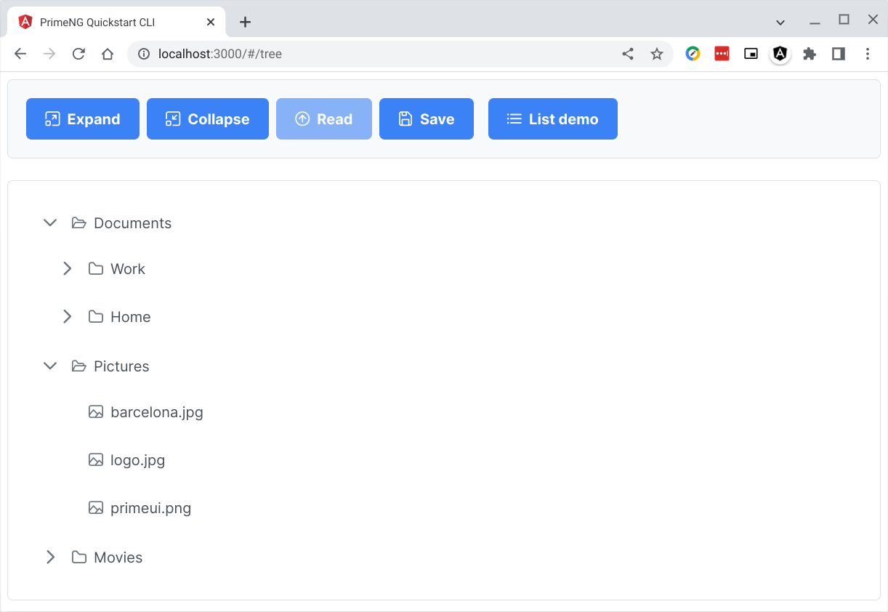

# pgsql-parse-json

## Parse JSON in PostgreSQL to save records

> ***This tutorial requires some knowledge in Linux, Docker, Git, Angular, PostgreSQL, and Go Programming Language.***

### Table of Contents
1. Introduction
2. Goal
3. Prerequisites
4. Clone this repo
5. Angular code
6. Go server code
7. PostgreSQL code
8. Running the ***webserv*** app
9. Conclusion

### 1. Introduction

We are continuing where we left-off in the previous tutorial [Go POST JSON passthru controller](https://github.com/cydriclopez/go-post-json-passthru).

The added code are: 1.) Postgresql database code, 2.) Go code package ***common*** to connect to Postgresql, and 3.) alter Go code package ***treedata*** to call the Postgresql stored-function code and pass the client Tree component JSON data.

In this tutorial we do not have new Angular sourcecode in the ***src/client*** folder. Instead what we have is the compiled version, from the previous tutorial [Go POST JSON passthru controller](https://github.com/cydriclopez/go-post-json-passthru), in the ***src/client/dist-static*** folder. I have a ***.gitignore*** rule to block the ***dist*** folder so I had to rename to ***dist-static***.


### 2. Goal

Our goal is to save our tree component JSON data from our app screen:
<br/>
<kbd></kbd>
<br/>

Into our Go pass-thru controller server-side screen console:
<br/>
```bash
:webserv .
2022/09/05 13:07:59 PostgreSQL 14.2 (Debian 14.2-1.pgdg110+1) on x86_64-pc-linux-gnu, compiled by gcc (Debian 10.2.1-6) 10.2.1 20210110, 64-bit
2022/09/05 13:07:59
Serving static folder: .
Listening on port: :3000
Press Ctrl-C to stop server
```
<code>
2022/09/05 13:09:42 jsonData: [{"label":"Documents","expandedIcon":"pi pi-folder-open","collapsedIcon":"pi pi-folder","data":"Documents Folder","children":[{"label":"Work","expandedIcon":"pi pi-folder-open","collapsedIcon":"pi pi-folder","data":"Work Folder","children":[{"label":"Expenses.doc","icon":"pi pi-file","data":"Expenses Document"},{"label":"Resume.doc","icon":"pi pi-file","data":"Resume Document"}],"toexpand":false},{"label":"Home","expandedIcon":"pi pi-folder-open","collapsedIcon":"pi pi-folder","data":"Home Folder","children":[{"label":"Invoices.txt","icon":"pi pi-file","data":"Invoices for this month"}],"toexpand":false}],"toexpand":true},{"label":"Pictures","expandedIcon":"pi pi-folder-open","collapsedIcon":"pi pi-folder","data":"Pictures Folder","children":[{"label":"barcelona.jpg","icon":"pi pi-image","data":"Barcelona Photo"},{"label":"logo.jpg","icon":"pi pi-image","data":"PrimeFaces Logo"},{"label":"primeui.png","icon":"pi pi-image","data":"PrimeUI Logo"}],"toexpand":true},{"label":"Movies","expandedIcon":"pi pi-folder-open","collapsedIcon":"pi pi-folder","data":"Movies Folder","children":[{"label":"Al Pacino","data":"Pacino Movies","children":[{"label":"Scarface","icon":"pi pi-video","data":"Scarface Movie"},{"label":"Serpico","icon":"pi pi-video","data":"Serpico Movie"}]},{"label":"Robert De Niro","data":"De Niro Movies","children":[{"label":"Goodfellas","icon":"pi pi-video","data":"Goodfellas Movie"},{"label":"Untouchables","icon":"pi pi-video","data":"Untouchables Movie"}]}]}]
</code>
<br/>
<br/>

And finally, as records in a table in our Postgresql database:

```
postgres=# select * from tree_data;

 key | parent |     label      |    icon     |   expandedicon    | collapsedicon |          data           | leaf | toexpand
-----+--------+----------------+-------------+-------------------+---------------+-------------------------+------+----------
   1 |      0 | data           |             |                   |               | data                    | f    | t
   2 |      1 | Documents      |             | pi pi-folder-open | pi pi-folder  | Documents Folder        | f    | t
   3 |      2 | Work           |             | pi pi-folder-open | pi pi-folder  | Work Folder             | f    | f
   4 |      3 | Expenses.doc   | pi pi-file  |                   |               | Expenses Document       | t    | f
   5 |      3 | Resume.doc     | pi pi-file  |                   |               | Resume Document         | t    | f
   6 |      2 | Home           |             | pi pi-folder-open | pi pi-folder  | Home Folder             | f    | f
   7 |      6 | Invoices.txt   | pi pi-file  |                   |               | Invoices for this month | t    | f
   8 |      1 | Pictures       |             | pi pi-folder-open | pi pi-folder  | Pictures Folder         | f    | t
   9 |      8 | barcelona.jpg  | pi pi-image |                   |               | Barcelona Photo         | t    | f
  10 |      8 | logo.jpg       | pi pi-image |                   |               | PrimeFaces Logo         | t    | f
  11 |      8 | primeui.png    | pi pi-image |                   |               | PrimeUI Logo            | t    | f
  12 |      1 | Movies         |             | pi pi-folder-open | pi pi-folder  | Movies Folder           | f    | f
  13 |     12 | Al Pacino      |             |                   |               | Pacino Movies           | f    | f
  14 |     13 | Scarface       | pi pi-video |                   |               | Scarface Movie          | t    | f
  15 |     13 | Serpico        | pi pi-video |                   |               | Serpico Movie           | t    | f
  16 |     12 | Robert De Niro |             |                   |               | De Niro Movies          | f    | f
  17 |     16 | Goodfellas     | pi pi-video |                   |               | Goodfellas Movie        | t    | f
  18 |     16 | Untouchables   | pi pi-video |                   |               | Untouchables Movie      | t    | f
(18 rows)

postgres=#
```

### 3. Prerequisites

I assume that you have a working [Angular](https://github.com/cydriclopez/docker-ng-dev), [PostgreSQL](https://github.com/cydriclopez/docker-pg-dev) and [Go](https://github.com/cydriclopez/go-static-server#3-install-go) installations. Please checkout the previous tutorials that cover these topics.

As already mentioned before, this tutorial builds on the previous tutorial [Go POST JSON passthru controller](https://github.com/cydriclopez/go-post-json-passthru). I suggest you go thru this tutorial especially if you are new to Angular and Go.


### 4. Clone this repo

Clone this repo then change into the repo folder. You can follow the commands below. You may have to adjust according to your own chosen directory structure.

```bash
user1@penguin:~/Projects$
:git clone https://github.com/cydriclopez/pgsql-parse-json.git

# Change into the just cloned folder
user1@penguin:~/Projects$
:cd pgsql-parse-json/src

# List folder contents
user1@penguin:~/Projects/pgsql-parse-json/src$
:ll

drwxr-xr-x 1 user1 user1  46 Aug 15 12:41 .
drwxr-xr-x 1 user1 user1  78 Sep  5 13:16 ..
drwxr-xr-x 1 user1 user1  22 Sep  3 13:06 client
drwx--x--x 1 user1 user1  58 Sep  3 13:09 docker
drwxr-xr-x 1 user1 user1 118 Sep  3 12:39 pgsql
drwxr-xr-x 1 user1 user1  84 Sep  3 13:12 server
```

### 5. Angular code

As already mentioned, in this tutorial we do not have new Angular sourcecode in the ***src/client*** folder. Instead what we have is the compiled version, from the previous tutorial [Go POST JSON passthru controller](https://github.com/cydriclopez/go-post-json-passthru), in the ***src/client/dist-static*** folder. I have a ***.gitignore*** rule to block the ***dist*** folder so I had to rename to ***dist-static***.

Further down below we will run our Go server-side app ***webserv*** and pass this Angular compiled folder:

```bash
# The dot after the executable webserv passes the current folder
user1@penguin:~/Projects/pgsql-parse-json$
:cd src/client/dist-static/primeng-quickstart-cli
:webserv .
```

### 6. Go server code

#### 6.1. Go server app in 4 packages

The Go server-side code is simple. We have refactored the previous tutorial's Go code into [4 packages](https://github.com/cydriclopez/pgsql-parse-json/tree/main/src/server). We have done just a few refactors: 1.) We added the ***common*** package, and 2.) altered the method ***saveJsonData()*** in package ***treedata***. We have mostly inherited from the Go code in the previous tutorial [Go POST JSON passthru controller](https://github.com/cydriclopez/go-post-json-passthru/tree/main/src/server).

| # | package   | file | purpose |
| --- | ----------- | --- | ----------- |
| 1 | main | [src/server/webserv.go](https://github.com/cydriclopez/pgsql-parse-json/blob/main/src/server/webserv.go) | main ***webserv*** executable  |
| 2 | common | [src/server/common/common.go](https://github.com/cydriclopez/pgsql-parse-json/blob/main/src/server/common/common.go) | Postgresql connector  |
| 3 | params | [src/server/params/params.go](https://github.com/cydriclopez/pgsql-parse-json/blob/main/src/server/params/params.go) | process the command-line args |
| 4 | treedata | [src/server/treedata/treedata.go](https://github.com/cydriclopez/pgsql-parse-json/blob/main/src/server/treedata/treedata.go) | process the tree JSON data |

#### 6.2. Package treedata method saveJsonData() to save data

In the package ***treedata*** we have the ***saveJsonData()*** method. We have done some refactoring on this method. Aside from merely printing the JSON data on the console screen, it now calls our Postgresql database stored-function with the statement: ***sql := "select tree_insert($1)"***

Then in the next line we call Postgresql with the expression: ***t.Pgx.Con.Exec(t.Pgx.Ctx, sql, t.Jdata.Data)***

```go
// Save json data to db
func (t *tData) saveJsonData() error {
	// Print the data from the client
	log.Println("jsonData:", t.Jdata.Data)

	// SQL statement to call the stored-function
	sql := "select tree_insert($1)"

	// Call the Postgresql stored-function
	if _, err := t.Pgx.Con.Exec(t.Pgx.Ctx, sql, t.Jdata.Data); err != nil {
		return err
	}
	return nil
}
```

### 7. PostgreSQL code

#### 7.1. PostgreSQL code in 4 SQL files

Our Postgresql code consists of 4 SQL files located in folder [src/pgsql](https://github.com/cydriclopez/pgsql-parse-json/tree/main/src/pgsql).

| # | file   | location | purpose |
| --- | ----------- | --- | ----------- |
| 1 | tree_data.sql | [src/pgsql/tree_data.sql](https://github.com/cydriclopez/pgsql-parse-json/blob/main/src/pgsql/tree_data.sql) | create table tree_data |
| 2 | tree_insert.sql | [src/pgsql/tree_insert.sql](https://github.com/cydriclopez/pgsql-parse-json/blob/main/src/pgsql/tree_insert.sql) | create function tree_insert() |
| 3 | tree_insert_do.sql | [src/pgsql/tree_insert_do.sql](https://github.com/cydriclopez/pgsql-parse-json/blob/main/src/pgsql/tree_insert_do.sql) | test function tree_insert() |
| 4 | tree_type.sql | [src/pgsql/tree_type.sql](https://github.com/cydriclopez/pgsql-parse-json/blob/main/src/pgsql/tree_type.sql) | create type tree_type |

#### 7.2. File tree_insert.sql

The 2nd file ***tree_insert.sql*** is the more interesting Postgresql code of the 4 files. Below is the listing. It is quite straightforward. It merely loops through the ***children*** parameter a JSON array at a time and grabs values. It recursively calls itself for any non-null child ***children*** member. It uses the type ***tree_type*** when parsing the ***children*** members.

```sql
-- Parse tree json data and save records
-- CL 9/1/2022
create or replace function tree_insert(
    children   jsonb,           -- json to recourse into
    parent     int default 0    -- the parent key
) returns void as
$$
declare
    _record     record;
    _leaf       boolean default false;
    _key        int;

begin
    -- Clear table & insert root record
    if tree_insert.parent = 0 then
        -- First clear output table & reset pk
        truncate tree_data restart identity;

        -- Initial serial PK "key" is the first parent
        insert into tree_data (parent, leaf, label, "data", toexpand)
            values (0, false, 'data', 'data', true)
            returning "key" into tree_insert.parent;
    end if;

    -- Loop thru the children json array using type tree_type
    for _record in
        select
            js.key,
            js.parent,
            js.label,
            js.icon,
            js."expandedIcon",
            js."collapsedIcon",
            js.data,
            js.toexpand,
            js.children

        -- Read documentation on jsonb_populate_recordset()
        from jsonb_populate_recordset(
            null::tree_type,
            tree_insert.children) as js
        loop
            -- Check if entry has children
            _leaf = _record.children is null;

            -- Set toexpand to false if it's null
            _record.toexpand = coalesce(_record.toexpand, false);

            -- Inserted serial PK "key" is the parent in
            -- the succeeding recursive call if it has children.
            insert into tree_data (parent, label, icon, expandedIcon,
                    collapsedIcon, "data", leaf, toexpand)
                values (tree_insert.parent, _record.label, _record.icon,
                    _record."expandedIcon",  _record."collapsedIcon",
                    _record.data, _leaf, _record.toexpand)
                returning "key" into _key;

            -- Recursive call to read next json array entry.
            -- Inserted serial PK "key" is parent for next children.
            if not _leaf then
                perform tree_insert(
                    _record.children,   -- next json segment to scan
                    _key                -- the new parent
                );
            end if;
        end loop;

    return;
end;
$$
language plpgsql;
```

#### 7.3. Running 4 SQL files to load them in Postgresql.

This tutorial requires that you have followed thru the 2nd tutorial [Dockerize your PostgreSQL dev environment](https://github.com/cydriclopez/docker-pg-dev). It is necessary to setup your development Postgresql environment. You may need to redo the ***postgres14*** docker container by re-running the bash script [postgres14](https://github.com/cydriclopez/pgsql-parse-json/blob/main/src/docker/postgres14) which is listed below.

You may need alter the 2nd ***-v*** volume mapping parameter according to your choice folder. Substitute your own path here if necessary. However try maintain the container mapping into the ***:/home/psql/pgsql-json*** folder.

Before re-running the ***postgres14*** script you will have to first delete it with: ***docker rm postgres14***

```bash
#!/bin/bash
# postgres14
# Make sure to run:
# chmod +x postgres14
# to make this bash script file executable. This script will run the
# postgres image in detached mode, name it postgres14, and create
# volume postgres_volume if not existing. This volume provides
# persistence when the container ceases running. It will also bind
# mount your project folder as the working folder.
docker run -d --name=postgres14 -p 5432:5432 \
--mount source=postgres_volume,target=/var/lib/postgresql/data \
-v /home/user1/Projects/psql:/home/psql \
-v /home/user1/Projects/pgsql-parse-json/src/pgsql\
:/home/psql/pgsql-json \
-w /home/psql \
-e POSTGRES_PASSWORD="my-postgres-password" postgres

# Run "docker rm postgres14" to remove this container from memory.
```

#### 7.4. Make sure your ***~/.bashrc*** has aliases ***pgstart***, ***pgend***, and ***psql*** defined.

Towards the end of the 2nd tutorial [Dockerize your PostgreSQL dev environment](https://github.com/cydriclopez/docker-pg-dev) there is a part to [Add these 3 aliases in ~/.bashrc](https://github.com/cydriclopez/docker-pg-dev#5-add-these-3-aliases-in-bashrc):

```bash
alias pgstart='docker start postgres14'
alias pgstop='docker stop postgres14'
alias psql='docker exec -it postgres14 psql -U postgres'
```

With these aliases in your ***~/.bashrc*** file defined, then we can proceed to the next steps.

#### 7.5. Test-run the function tree_insert().

```bash
# We change folder into our cloned folder
user1@penguin:~$
:cd Projects/pgsql-parse-json

# Run the pgstart alias to run Postgresql
user1@penguin:~/Projects/pgsql-parse-json$
:pgstart
postgres14

# Run psql alias to run the container's psql executable
user1@penguin:~/Projects/pgsql-parse-json$
:psql
psql (14.2 (Debian 14.2-1.pgdg110+1))
Type "help" for help.

# In 7.3. we mapped into the container's pgsql-json folder.
# So here we change into that folder.
postgres=# \cd pgsql-json/

# We list the folders in this pgsql-json folder
postgres=# \! ls -l
-rw-r--r-- 1 1000 1000  366 Sep  3 20:50 tree_data.sql
-rw-r--r-- 1 1000 1000 1790 Sep  5 20:23 tree_insert_do.sql
-rw-r--r-- 1 1000 1000 2355 Sep  4 07:35 tree_insert.sql
-rw-r--r-- 1 1000 1000  377 Sep  3 20:51 tree_type.sql

# We run the 1st file to create table tree_data
postgres=# \i tree_data.sql

# Check to make sure table tree_data exists
postgres=# \dt tree*
           List of relations
 Schema |   Name    | Type  |  Owner
--------+-----------+-------+----------
 public | tree_data | table | postgres
(1 row)

# We run the 4th file to create type tree_type
postgres=# \i tree_type.sql

# Check to make sure type tree_type exists
postgres=# \dT tree*
        List of data types
 Schema |   Name    | Description
--------+-----------+-------------
 public | tree_type |
(1 row)

# We run the 3rd file to create function tree_insert
postgres=# \i tree_insert.sql
CREATE FUNCTION

# Check to make sure function tree_insert exists
postgres=# \df tree*
                                     List of functions
 Schema |    Name     | Result data type |           Argument data types            | Type
--------+-------------+------------------+------------------------------------------+------
 public | tree_insert | void             | children jsonb, parent integer DEFAULT 0 | func
(1 row)

# Test run the just created function tree_insert
postgres=# \i tree_insert_do.sql
DO
 key | parent |     label      |    icon     |   expandedicon    | collapsedicon |          data           | leaf | toexpand
-----+--------+----------------+-------------+-------------------+---------------+-------------------------+------+----------
   1 |      0 | data           |             |                   |               | data                    | f    | t
   2 |      1 | Documents      |             | pi pi-folder-open | pi pi-folder  | Documents Folder        | f    | t
   3 |      2 | Work           |             | pi pi-folder-open | pi pi-folder  | Work Folder             | f    | f
   4 |      3 | Expenses.doc   | pi pi-file  |                   |               | Expenses Document       | t    | f
   5 |      3 | Resume.doc     | pi pi-file  |                   |               | Resume Document         | t    | f
   6 |      2 | Home           |             | pi pi-folder-open | pi pi-folder  | Home Folder             | f    | f
   7 |      6 | Invoices.txt   | pi pi-file  |                   |               | Invoices for this month | t    | f
   8 |      1 | Pictures       |             | pi pi-folder-open | pi pi-folder  | Pictures Folder         | f    | t
   9 |      8 | barcelona.jpg  | pi pi-image |                   |               | Barcelona Photo         | t    | f
  10 |      8 | logo.jpg       | pi pi-image |                   |               | PrimeFaces Logo         | t    | f
  11 |      8 | primeui.png    | pi pi-image |                   |               | PrimeUI Logo            | t    | f
  12 |      1 | Movies         |             | pi pi-folder-open | pi pi-folder  | Movies Folder           | f    | f
  13 |     12 | Al Pacino      |             |                   |               | Pacino Movies           | f    | f
  14 |     13 | Scarface       | pi pi-video |                   |               | Scarface Movie          | t    | f
  15 |     13 | Serpico        | pi pi-video |                   |               | Serpico Movie           | t    | f
  16 |     12 | Robert De Niro |             |                   |               | De Niro Movies          | f    | f
  17 |     16 | Goodfellas     | pi pi-video |                   |               | Goodfellas Movie        | t    | f
  18 |     16 | Untouchables   | pi pi-video |                   |               | Untouchables Movie      | t    | f
(18 rows)
```

At this point our Postgresql database is ready.

### 8. Running the ***webserv*** app

We now need to compile and then run our ***webserv*** app. The following steps will explain this process.

#### 8.1. Compiling the ***webserv*** app

```bash
```

#### 8.2. Running the ***webserv*** app

```bash
```

#### 8.3. Running the browser app from ***localhost:3000***

<br/>
<kbd></kbd>
<br/>

#### 8.4. Testing our webapp from ***localhost:3000***


```bash
```


### 9. Conclusion


Under construction!
But you can peek into the completed committed source-code.
Happy coding! 😊

---
